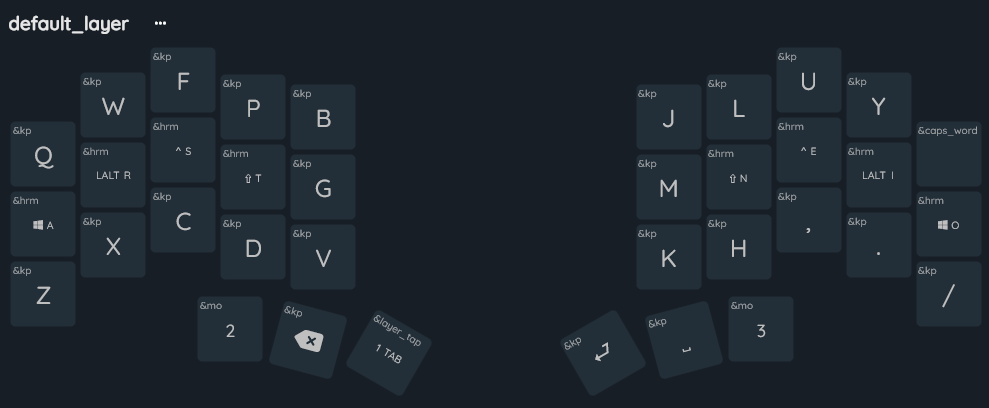
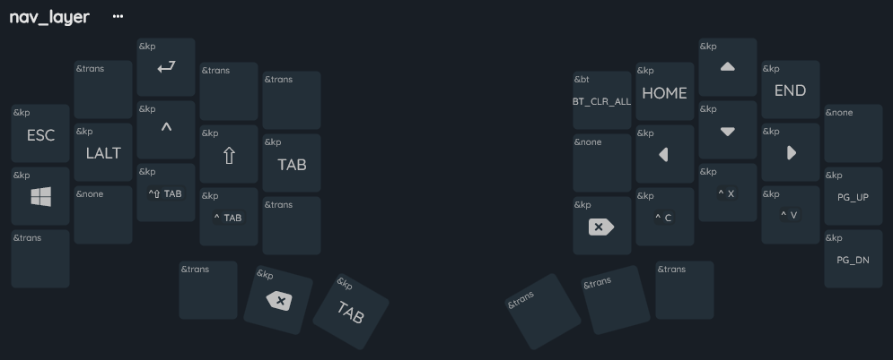
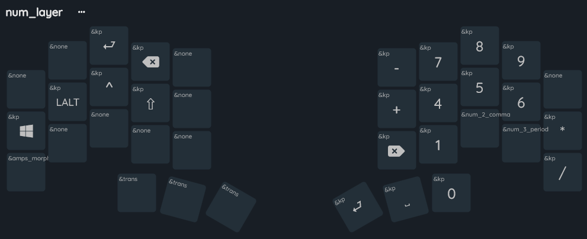
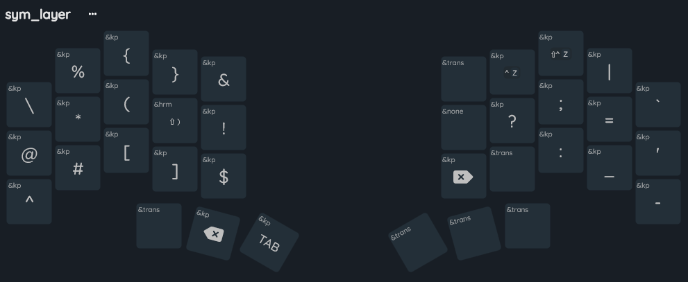

# Temper ZMK Config

This is my personal ZMK config for the [temper](https://github.com/raeedcho/temper).

Some notes about this config:
- Four main layers (default, numbers, symbols, and navigation)
- Colemak DH

